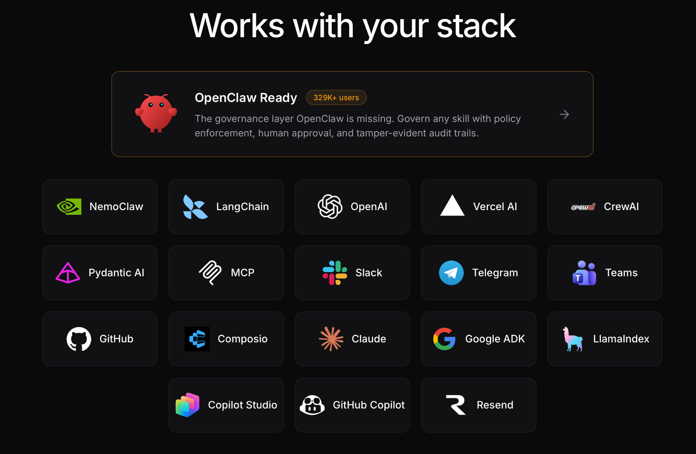

<div align="center">

# SidClaw

**Approve, deny, and audit AI agent tool calls.**

Works with MCP, LangChain, OpenAI Agents, Claude Agent SDK, and 15+ more.

[](https://github.com/sidclawhq/platform/stargazers)
[](https://www.npmjs.com/package/@sidclaw/sdk)
[](https://pypi.org/project/sidclaw/)
[](LICENSE)
[](LICENSE-PLATFORM)
[](https://github.com/sidclawhq/platform/actions)
[](https://github.com/sidclawhq/platform/actions)

<a href="https://sidclaw.com" target="_blank">Website</a> · <a href="https://docs.sidclaw.com" target="_blank">Documentation</a> · <a href="https://demo.sidclaw.com" target="_blank">Live Demo</a> · <a href="https://www.npmjs.com/package/@sidclaw/sdk" target="_blank">SDK on npm</a> · <a href="https://pypi.org/project/sidclaw/" target="_blank">SDK on PyPI</a>

</div>

---

Your agents call tools without oversight. SidClaw intercepts every tool call, checks it against your policies, and holds risky actions for human review before they execute.

### Try it locally (self-contained, no install)

Clone and run:

```bash
git clone https://github.com/sidclawhq/platform
cd platform/packages/sidclaw-demo && node cli.mjs
```

Opens a local governance dashboard at `http://localhost:3030` with four pre-loaded scenarios (Claude Code `rm -rf`, fintech trade, DevOps scale-to-zero, clinical lab order). No signup, no Docker, no API key — just the approval card UX running in your browser.

> **Coming to npm soon**: `npx sidclaw-demo` one-liner will be published alongside the next SDK release. Until then, the clone-and-run path above is the canonical way to see the demo.

### See it in action


*Agent wants to send an email → policy flags it → reviewer sees full context → approves or denies → trace recorded.*

## Works With Your Stack

<div align="center">



</div>

SidClaw integrates with **18+ frameworks and platforms** — including OpenClaw (329K+ users), LangChain, OpenAI, MCP, Claude Agent SDK, Google ADK, NemoClaw, Copilot Studio, GitHub Copilot, and more. Add governance in one line of code. <a href="https://docs.sidclaw.com/docs/integrations" target="_blank">See all integrations →</a>

## See It In Action

### Customer Support Agent (Financial Services)


*An AI agent wants to send a customer email. Policy flags it for review. The reviewer sees full context — who, what, why — and approves with one click. Every step is traced.*

### Infrastructure Automation (DevOps)


*An AI agent wants to scale production services. High-risk deployments require human approval. Read-only monitoring is allowed instantly.*

### Clinical Decision Support (Healthcare)


*An AI assistant recommends lab orders. The physician reviews the clinical context and approves. Medication prescribing is blocked by policy — only physicians can prescribe.*

## How It Works

```
Agent wants to act → SidClaw evaluates → Policy decides → Human approves (if needed) → Action executes → Trace recorded
```

Four primitives govern every agent action:

```
┌──────────┐    ┌──────────┐    ┌──────────┐    ┌──────────┐
│ Identity │ →  │  Policy  │ →  │ Approval │ →  │  Trace   │
│          │    │          │    │          │    │          │
│ Every    │    │ Every    │    │ High-risk│    │ Every    │
│ agent    │    │ action   │    │ actions  │    │ decision │
│ has an   │    │ evaluated│    │ get human│    │ creates  │
│ owner &  │    │ against  │    │ review   │    │ tamper-  │
│ scoped   │    │ explicit │    │ with rich│    │ proof    │
│ perms    │    │ rules    │    │ context  │    │ audit    │
└──────────┘    └──────────┘    └──────────┘    └──────────┘
```

- **allow** → action executes immediately, trace recorded
- **approval_required** → human sees context card, approves/denies, trace recorded
- **deny** → blocked before execution, no data accessed, trace recorded

## Deploy your own SidClaw instance ($0)

Railway is the recommended one-click deploy — it spins up Postgres + API + Dashboard together. Vercel hosts only the Next.js dashboard; pair it with a hosted API.

[](https://railway.com/new/template?template=https://github.com/sidclawhq/platform)

<details>
<summary><strong>Vercel (dashboard only — point at an existing SidClaw API)</strong></summary>

```
https://vercel.com/new/clone?repository-url=https%3A%2F%2Fgithub.com%2Fsidclawhq%2Fplatform&root-directory=apps%2Fdashboard&env=NEXT_PUBLIC_API_URL&envDescription=Your%20SidClaw%20API%20base%20URL%20(e.g.%20https%3A%2F%2Fapi.sidclaw.com)
```

Vercel can only host the dashboard (Next.js). The API is Fastify — deploy it to Railway, Fly, Render, or run via Docker. Set `NEXT_PUBLIC_API_URL` on the dashboard project to point at it.

</details>

Under 3 minutes to a working instance on Railway.

---

## Quick Start — Pick What Fits

### Option 1: Claude Code Hooks (zero code)

For Claude Code users. Every `Bash`, `Write`, `Agent`, `mcp__*` tool call is governed by SidClaw:

```bash
# In the SidClaw platform repo
npm run hooks:install

# Then set two env vars
export SIDCLAW_BASE_URL=https://api.sidclaw.com
export SIDCLAW_API_KEY=ai_your_key_here
```

Restart Claude Code. `rm -rf` pauses for approval, `git push --force` gets flagged, every tool call is traced with a hash-chained audit trail. See [hooks/README.md](hooks/README.md).

### Option 2: `create-sidclaw-app` (interactive scaffold)

```bash
npx create-sidclaw-app my-agent
cd my-agent
npm start
```

### Option 3: MCP Governance Proxy (zero code, wraps any MCP server)

Jump to the [MCP Governance Proxy section below](#mcp-governance-proxy).

### Option 4: SDK wrapper (one line per tool)

```typescript
// Before: the agent decides, nobody reviews
await sendEmail({ to: "customer@example.com", subject: "Follow-up", body: "..." });

// After: wrap with SidClaw — now policies apply
const sendEmail = withGovernance(client, {
  operation: 'send_email',
  data_classification: 'confidential',
}, sendEmailFn);

await sendEmail({ to: "customer@example.com", subject: "Follow-up", body: "..." });
// → allow (executes) | approval_required (human reviews) | deny (blocked)
```

<details>
<summary>Same thing in Python</summary>

```python
@with_governance(client, GovernanceConfig(
    operation="send_email",
    data_classification="confidential",
))
def send_email(to, subject, body):
    email_service.send(to=to, subject=subject, body=body)
```
</details>

<details>
<summary><strong>Full TypeScript example with imports</strong></summary>

```bash
npm install @sidclaw/sdk
```

```typescript
import { AgentIdentityClient, withGovernance } from '@sidclaw/sdk';

const client = new AgentIdentityClient({
  apiKey: process.env.SIDCLAW_API_KEY,
  apiUrl: 'https://api.sidclaw.com',
  agentId: process.env.SIDCLAW_AGENT_ID,
});

const sendEmail = withGovernance(client, {
  operation: 'send_email',
  target_integration: 'email_service',
  resource_scope: 'customer_emails',
  data_classification: 'confidential',
}, async (to, subject, body) => {
  await emailService.send({ to, subject, body });
});

await sendEmail('customer@example.com', 'Follow-up', 'Hello...');
// allow → executes | approval_required → waits for human | deny → throws
```

</details>

<details>
<summary><strong>Full Python example with imports</strong></summary>

```bash
pip install sidclaw
```

```python
import os
from sidclaw import SidClaw
from sidclaw.middleware.generic import with_governance, GovernanceConfig

client = SidClaw(
    api_key=os.environ["SIDCLAW_API_KEY"],
    agent_id=os.environ["SIDCLAW_AGENT_ID"],
)

@with_governance(client, GovernanceConfig(
    operation="send_email",
    target_integration="email_service",
    data_classification="confidential",
))
def send_email(to, subject, body):
    email_service.send(to=to, subject=subject, body=body)
```

</details>

## MCP Governance Proxy

Wrap any MCP server with policy evaluation and approval workflows. Works with Claude Desktop, Cursor, VS Code, GitHub Copilot — any MCP client. Listed on the <a href="https://registry.modelcontextprotocol.io" target="_blank">official MCP Registry</a>.

Add to your `.mcp.json`:

```json
{
  "mcpServers": {
    "postgres-governed": {
      "command": "npx",
      "args": ["-y", "@sidclaw/sdk", "sidclaw-mcp-proxy", "--transport", "stdio"],
      "env": {
        "SIDCLAW_API_KEY": "ai_your_key",
        "SIDCLAW_AGENT_ID": "your-agent-id",
        "SIDCLAW_UPSTREAM_CMD": "npx",
        "SIDCLAW_UPSTREAM_ARGS": "-y,@modelcontextprotocol/server-postgres,postgresql://localhost/mydb"
      }
    }
  }
}
```

- `SELECT * FROM customers` → **allowed** (~50ms overhead)
- `DELETE FROM customers WHERE id = 5` → **held for human approval**
- `DROP TABLE customers` → **denied by policy**

<a href="https://docs.sidclaw.com/docs/integrations/claude-code" target="_blank">Full MCP governance docs →</a>

## Why not just auth / sandboxing / logging?

| Approach | What it solves | What it doesn't solve |
|----------|---------------|----------------------|
| **Auth (Okta, OAuth)** | Who is this agent? | Should this specific action execute right now? |
| **Sandboxing (Docker, WASM)** | Blast radius if something goes wrong | Whether the action should happen at all |
| **Logging (Langfuse, LangSmith)** | What happened after the fact | Intercepting actions before they execute |
| **Policy engines (OPA)** | General-purpose policy evaluation | Approval workflows, agent-specific context, audit trails |
| **SidClaw** | All of the above, plus the **Approval** primitive | — |

SidClaw sits at the **tool-call layer**: the moment an agent decides to act in the real world.

## Integrations

SidClaw wraps your existing agent tools — no changes to your agent logic.

### Agent Frameworks

| | TypeScript | Python |
|--|-----------|--------|
| Core client | `@sidclaw/sdk` | `sidclaw` |
| MCP proxy | `@sidclaw/sdk/mcp` | `sidclaw.mcp` |
| LangChain | `@sidclaw/sdk/langchain` | `sidclaw.middleware.langchain` |
| OpenAI Agents | `@sidclaw/sdk/openai-agents` | `sidclaw.middleware.openai_agents` |
| CrewAI | `@sidclaw/sdk/crewai` | `sidclaw.middleware.crewai` |
| Vercel AI | `@sidclaw/sdk/vercel-ai` | — |
| Pydantic AI | — | `sidclaw.middleware.pydantic_ai` |
| Claude Agent SDK | `@sidclaw/sdk/claude-agent-sdk` | `sidclaw.middleware.claude_agent_sdk` |
| Google ADK | `@sidclaw/sdk/google-adk` | `sidclaw.middleware.google_adk` |
| LlamaIndex | `@sidclaw/sdk/llamaindex` | `sidclaw.middleware.llamaindex` |
| Composio | `@sidclaw/sdk/composio` | `sidclaw.middleware.composio` |
| NemoClaw | `@sidclaw/sdk/nemoclaw` | `sidclaw.middleware.nemoclaw` |
| Webhooks | `@sidclaw/sdk/webhooks` | `sidclaw.webhooks` |

### Platform Integrations

| Integration | Description |
|---|---|
| **Claude Code** | Govern any MCP server in Claude Code. Add a `.mcp.json` entry — zero code changes. <a href="https://docs.sidclaw.com/docs/integrations/claude-code" target="_blank">Guide →</a> |
| **OpenClaw** | Governance proxy for OpenClaw skills. Published as `sidclaw-governance` on ClawHub. <a href="https://docs.sidclaw.com/docs/integrations/openclaw" target="_blank">Guide →</a> |
| **MCP** | Governance proxy for any MCP server. Listed on the <a href="https://registry.modelcontextprotocol.io" target="_blank">official MCP Registry</a>. CLI binary (`sidclaw-mcp-proxy`) + programmatic API. <a href="https://docs.sidclaw.com/docs/integrations/mcp" target="_blank">Guide →</a> |
| **NemoClaw** | Govern NVIDIA NemoClaw sandbox tools with MCP-compatible proxy generation. <a href="https://docs.sidclaw.com/docs/integrations/nemoclaw" target="_blank">Guide →</a> |
| **Copilot Studio** | Governance for Microsoft Copilot Studio skills via OpenAPI action. <a href="https://docs.sidclaw.com/docs/integrations/copilot-studio" target="_blank">Guide →</a> |
| **GitHub Copilot** | Governance for GitHub Copilot agents via HTTP transport. <a href="https://docs.sidclaw.com/docs/integrations/github-copilot" target="_blank">Guide →</a> |
| **GitHub Action** | `sidclawhq/governance-action@v1` — reusable CI governance step. <a href="https://docs.sidclaw.com/docs/integrations/github-action" target="_blank">Guide →</a> |

### Notification Channels

Approval requests are delivered to your team's preferred channels. Reviewers can approve or deny directly from chat.

| Channel | Features |
|---|---|
| **Slack** | Block Kit messages with interactive Approve/Deny buttons. Messages update in-place after decision. |
| **Microsoft Teams** | Adaptive Card notifications with Approve/Deny buttons (Bot Framework) or dashboard links (webhook). |
| **Telegram** | HTML messages with inline keyboard. Callback updates remove buttons and add reply. |
| **Resend** | Email notifications for approval requests via transactional email. |

## Licensing

| Component | License | What you can do |
|-----------|---------|----------------|
| SDK (`@sidclaw/sdk`, `sidclaw` on PyPI) | Apache 2.0 | Use freely, modify, distribute, commercial use |
| MCP Proxy (`sidclaw-mcp-proxy`) | Apache 2.0 | Same as SDK |
| Platform (API, Dashboard, Docs) | FSL 1.1 | Free for orgs under CHF 1M revenue. Converts to Apache 2.0 in 2028 |

**Start with just the SDK?** You don't need the platform. The SDK works standalone with the free hosted API at <a href="https://app.sidclaw.com/signup" target="_blank">app.sidclaw.com</a>, or you can <a href="https://docs.sidclaw.com/docs/enterprise/self-hosting" target="_blank">self-host everything</a>.

## Why This Exists

AI agents are being deployed in production, but the governance layer is missing:

- **73% of CISOs** fear AI agent risks, but only **30%** are ready (<a href="https://neuraltrust.ai/guides/the-state-of-ai-agent-security-2026" target="_blank">NeuralTrust 2026</a>)
- **79% of enterprises** have blind spots where agents act without oversight
- **FINRA 2026** explicitly requires "documented human checkpoints" for AI agent actions in financial services
- **EU AI Act** (August 2026) mandates human oversight, automatic logging, and risk management for high-risk AI systems
- **OpenClaw** has 329K+ stars and 13,700+ skills — but <a href="https://thehackernews.com/2026/02/researchers-find-341-malicious-clawhub.html" target="_blank">1,184 malicious skills were found</a> in the ClawHavoc campaign. There's no policy layer governing what skills can do.

The big vendors (Okta, SailPoint, WorkOS) handle identity and authorization. But none of them ship the **approval step** — the part where a human sees rich context and makes an informed decision before an agent acts.

### Compliance

SidClaw maps to regulatory requirements across the US, EU, Switzerland, and Singapore:

🇺🇸 <a href="https://docs.sidclaw.com/docs/compliance/finra-2026" target="_blank">FINRA 2026</a> · 🇪🇺 <a href="https://docs.sidclaw.com/docs/compliance/eu-ai-act" target="_blank">EU AI Act</a> · 🇨🇭 <a href="https://docs.sidclaw.com/docs/compliance/finma" target="_blank">FINMA</a> · 🇸🇬 <a href="https://docs.sidclaw.com/docs/compliance/mas-trm" target="_blank">MAS TRM</a> · 🇺🇸 <a href="https://docs.sidclaw.com/docs/compliance/nist-ai-rmf" target="_blank">NIST AI RMF</a> · 🌐 <a href="https://docs.sidclaw.com/docs/compliance/owasp-agentic" target="_blank">OWASP Agentic</a>

## Platform Features

### For Developers
- **60-second setup** — `npx create-sidclaw-app` scaffolds a working governed agent
- **<50ms evaluation overhead** — the governance layer is invisible to your users
- **5-minute integration** — wrap existing tools, no code changes
- **MCP-native** — governance proxy for any MCP server
- **Framework-agnostic** — LangChain, Vercel AI, OpenAI, CrewAI, Pydantic AI, Composio, Claude Agent SDK, Google ADK, LlamaIndex, NemoClaw, or plain functions
- **Typed SDKs** — TypeScript (npm) + Python (PyPI)

### For Security & Compliance Teams
- **Policy engine** — allow / approval_required / deny with priority ordering and classification hierarchy
- **Approval workflow** — context-rich cards with agent reasoning, risk classification, and separation of duties
- **Audit trails** — correlated traces with integrity hash chains (tamper-proof)
- **SIEM export** — JSON and CSV, continuous webhook delivery

### For Platform Teams
- **RBAC** — admin, reviewer, viewer roles with enforced permissions
- **Tenant isolation** — automatic tenant scoping on every query
- **API key management** — scoped keys with rotation
- **Rate limiting** — per-tenant, per-endpoint-category
- **Webhooks** — real-time notifications for approvals, traces, lifecycle events
- **Chat integrations** — approve/deny from Slack, Teams, or Telegram without opening the dashboard
- **Self-serve signup** — GitHub, Google, email/password

## Architecture

```
┌─────────────┐     ┌──────────────┐     ┌──────────────────┐
│ Your Agent  │     │  SidClaw SDK │     │  SidClaw API     │
│             │ ──► │              │ ──► │                  │
│ LangChain   │     │ evaluate()   │     │ Policy Engine    │
│ MCP Server  │     │ withGovern() │     │ Approval Service │
│ OpenAI SDK  │     │ governTools()│     │ Trace Store      │
│ Any tool    │     │              │     │ Webhook Delivery │
└─────────────┘     └──────────────┘     └──────────────────┘
                                                   │
                                          ┌────────┴────────┐
                                          ▼                 ▼
                                ┌──────────────┐  ┌──────────────┐
                                │  Dashboard   │  │ Notifications│
                                │              │  │              │
                                │ Agents       │  │ Slack        │
                                │ Policies     │  │ Teams        │
                                │ Approvals    │  │ Telegram     │
                                │ Traces       │  │ Email        │
                                │ Settings     │  │ Webhooks     │
                                └──────────────┘  └──────────────┘
```

## Deploy

### One-Click Deploy

[](https://railway.app/new/github?repo=sidclawhq/platform)

Deploy from the GitHub repo to Railway. Add a PostgreSQL database, configure environment variables, and you're live.

[](https://vercel.com/new/clone?repository-url=https%3A%2F%2Fgithub.com%2Fsidclawhq%2Fplatform&root-directory=apps/dashboard&env=NEXT_PUBLIC_API_URL&envDescription=SidClaw%20API%20URL&envLink=https%3A%2F%2Fdocs.sidclaw.com%2Fdocs%2Fenterprise%2Fself-hosting&project-name=sidclaw-dashboard&repository-name=sidclaw-dashboard)

Deploy the dashboard to Vercel (requires a separately hosted API).

<details>
<summary>Deploy Docs or Landing Page to Vercel</summary>

**Docs:**

[](https://vercel.com/new/clone?repository-url=https%3A%2F%2Fgithub.com%2Fsidclawhq%2Fplatform&root-directory=apps/docs&project-name=sidclaw-docs&repository-name=sidclaw-docs)

**Landing Page:**

[](https://vercel.com/new/clone?repository-url=https%3A%2F%2Fgithub.com%2Fsidclawhq%2Fplatform&root-directory=apps/landing&project-name=sidclaw-landing&repository-name=sidclaw-landing)

</details>

### Self-Host (Docker)

```bash
curl -sSL https://raw.githubusercontent.com/sidclawhq/platform/main/deploy/self-host/setup.sh | bash
```

Or manually:

```bash
git clone https://github.com/sidclawhq/platform.git
cd platform
cp deployment/env.example .env  # edit with your values
docker compose -f docker-compose.production.yml up -d
```

**Development credentials:**
- Email: `admin@example.com` / Password: `admin`
- Or click **"Sign in with SSO"** on the login page to auto-login without a password

### Hosted Cloud

No infrastructure to manage. <a href="https://app.sidclaw.com/signup" target="_blank">Start free at app.sidclaw.com</a>

See <a href="https://docs.sidclaw.com/docs/enterprise/self-hosting" target="_blank">deployment documentation</a> for production configuration, environment variables, and upgrade guides.

## Documentation

- <a href="https://docs.sidclaw.com/docs/quickstart" target="_blank">Quick Start</a> — 2 minutes to first governed action
- <a href="https://docs.sidclaw.com/docs/sdk/client" target="_blank">SDK Reference</a> — every method documented
- <a href="https://docs.sidclaw.com/docs/integrations" target="_blank">Integrations</a> — MCP, OpenClaw, NemoClaw, LangChain, OpenAI, Claude Agent SDK, Google ADK, Copilot Studio, GitHub Copilot, and more
- <a href="https://docs.sidclaw.com/docs/platform/policies" target="_blank">Policy Guide</a> — authoring, versioning, testing
- <a href="https://docs.sidclaw.com/docs/compliance/finra-2026" target="_blank">Compliance</a> — 🇺🇸 FINRA · 🇪🇺 EU AI Act · 🇨🇭 FINMA · 🇸🇬 MAS TRM · 🇺🇸 NIST AI RMF · 🌐 OWASP
- <a href="https://docs.sidclaw.com/docs/api-reference" target="_blank">API Reference</a> — every endpoint

## Contributing

We welcome contributions! See [CONTRIBUTING.md](CONTRIBUTING.md) for guidelines.

The SDK (`packages/sdk/`) is Apache 2.0. The platform (`apps/`) is FSL 1.1.

## License

- **SDK** (`packages/sdk/`, `packages/shared/`): [Apache License 2.0](LICENSE) — use freely for any purpose
- **Platform** (`apps/api/`, `apps/dashboard/`, `apps/docs/`, `apps/landing/`, `apps/demo*/`): [Functional Source License 1.1](LICENSE-PLATFORM) — source-available. Cannot offer as a competing hosted service. Converts to Apache 2.0 after 2 years (March 2028).

## Links

- <a href="https://sidclaw.com" target="_blank">Website</a>
- <a href="https://docs.sidclaw.com" target="_blank">Documentation</a>
- <a href="https://app.sidclaw.com" target="_blank">Dashboard</a>
- <a href="https://www.npmjs.com/package/@sidclaw/sdk" target="_blank">TypeScript SDK (npm)</a>
- <a href="https://pypi.org/project/sidclaw/" target="_blank">Python SDK (PyPI)</a>
- <a href="https://github.com/sidclawhq/python-sdk" target="_blank">Python SDK (GitHub)</a>
- <a href="https://www.npmjs.com/package/create-sidclaw-app" target="_blank">create-sidclaw-app (npm)</a>
- <a href="https://github.com/sidclawhq/governance-action" target="_blank">GitHub Action</a>
- <a href="https://github.com/apps/sidclaw-governance" target="_blank">GitHub App</a>
- <a href="mailto:hello@sidclaw.com">Contact</a>
