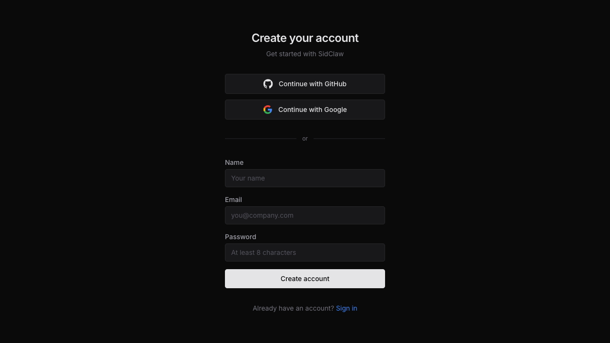
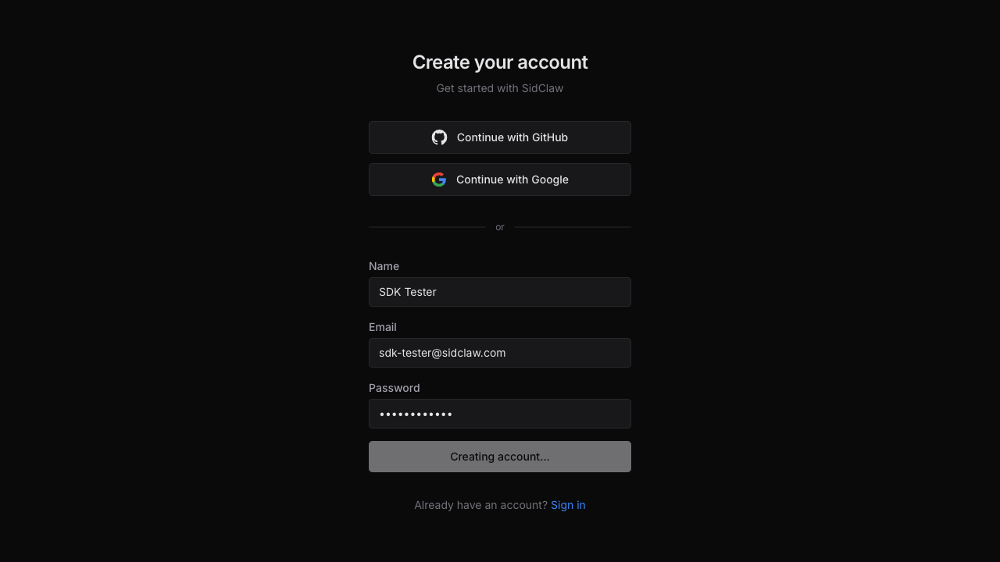
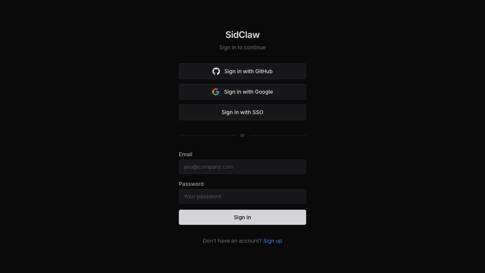
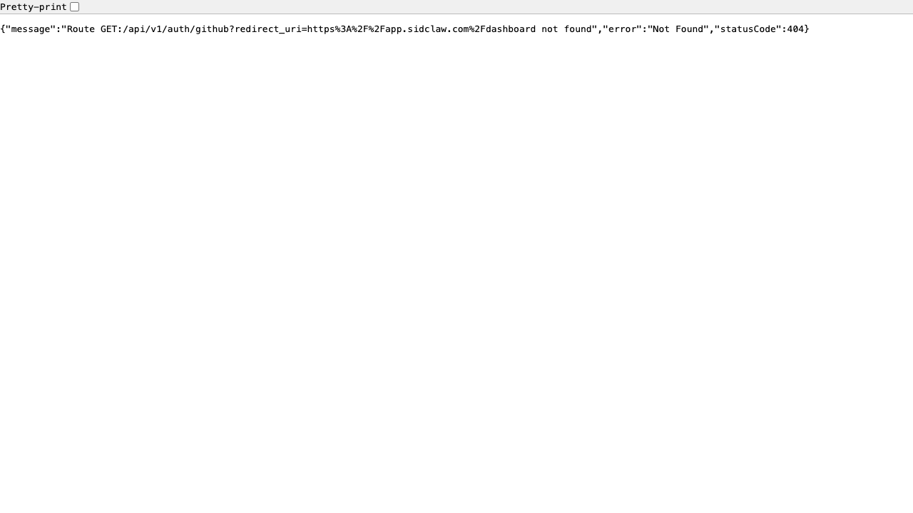
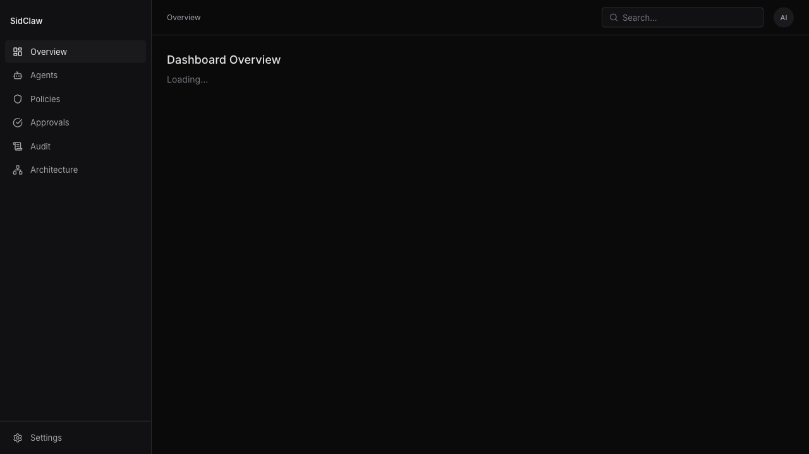
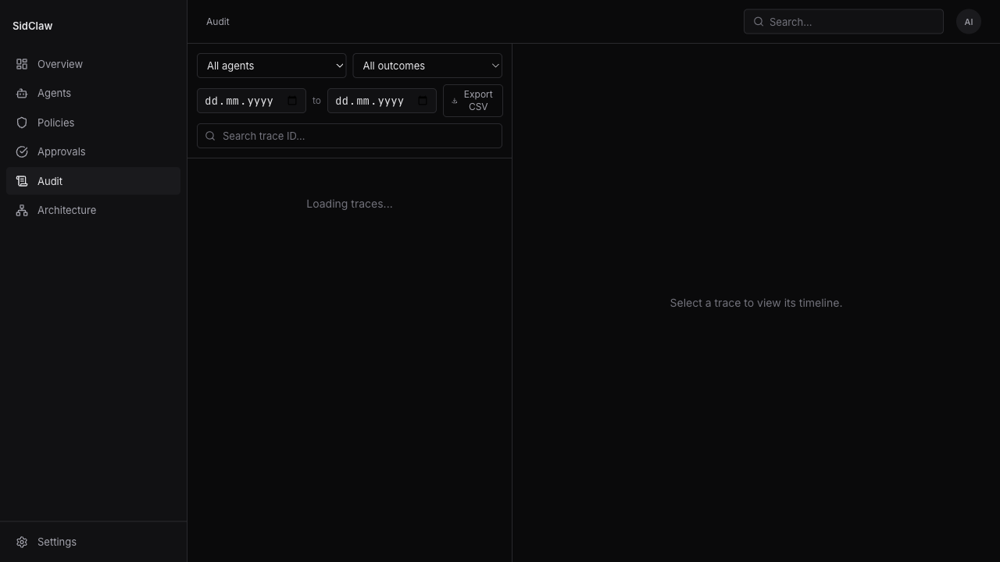
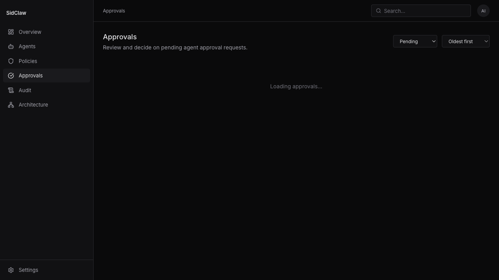

# Stress Test 4: SDK Developer Experience (Production)

**Date:** 2026-03-22
**Persona:** Backend developer integrating SidClaw SDK for the first time
**SDK version:** @sidclaw/sdk 0.1.0
**API target:** https://api.sidclaw.com (production)
**Dashboard:** https://app.sidclaw.com
**Node.js:** v24.3.0

---

## 1. SDK Installation

### npm install from registry

| Check | Result | Notes |
|-------|--------|-------|
| `npm install @sidclaw/sdk` | **FAIL** | `@sidclaw/shared` dependency not published to npm |
| Install time | N/A | Blocked by missing dependency |
| Install size | SDK: ~980KB, Shared: ~580KB (measured from local install) | Reasonable |
| `--force` / `--legacy-peer-deps` | **FAIL** | `@sidclaw/shared` is a hard dependency, not peer |

**Blocker:** The SDK is published to npm (`@sidclaw/sdk@0.1.0` by `vlpetrov`) but its dependency `@sidclaw/shared` is NOT published. No external developer can install the SDK. This is a **P0 launch blocker**.

**Workaround used:** Installed from local filesystem paths for remaining tests.

### Import verification (via local install)

| Export | CJS (`require`) | ESM (`import`) |
|--------|:---:|:---:|
| Main (`@sidclaw/sdk`) | `AgentIdentityClient`: function | function |
| `@sidclaw/sdk/langchain` | `governTool`: function | N/T |
| `@sidclaw/sdk/vercel-ai` | `governVercelTool`: function | N/T |
| `@sidclaw/sdk/openai-agents` | `governOpenAITool`: function | N/T |
| `@sidclaw/sdk/mcp` | `GovernanceMCPServer`: function | N/T |
| `@sidclaw/sdk/webhooks` | `verifyWebhookSignature`: function | N/T |

All 5 subpath exports resolve correctly. Both CJS and ESM main entry points work.

---

## 2. Signup & API Key

### Dashboard signup (https://app.sidclaw.com/signup)

- Signup form renders correctly (GitHub, Google OAuth, email/password)
- Form submission: **BROKEN** -- button changes to "Creating account..." and hangs indefinitely
- Console shows: `Failed to load resource: the server responded with a status of 404`
- Root cause: Dashboard frontend is calling the wrong API route or the Next.js API proxy is misconfigured in production

### API signup (POST /api/v1/auth/signup)

- Works correctly via curl
- Returns `{ user, tenant, api_key }` in a single response -- good DX
- API key is auto-generated on signup -- no extra step needed
- Note: shell quoting can cause `Invalid JSON in request body` errors; using `printf | curl -d @-` pattern works reliably

### Dashboard login (https://app.sidclaw.com/login)

- Login form renders correctly
- Email login submission: **BROKEN** -- hangs on "Signing in..."
- First attempt clicked wrong button and redirected to `GET:/api/v1/auth/github` (invalid route; correct route is `/api/v1/auth/login/github`) -- route mismatch bug
- Session cookies from API login + manual injection into browser works as a workaround

### Health endpoint

- `/api/v1/health` returns **404**
- `/health` returns healthy response with DB latency
- DX issue: developers will try the versioned path first

### Default API key scopes

Default scopes from signup: `['evaluate', 'traces:read', 'traces:write', 'approvals:read']`

**Missing for onboarding:** No `agents:write`, `policies:write`, or `admin` scope. A new user cannot create agents or policies with their default API key. They must:
1. Login via API to get a session cookie + CSRF token
2. Create a new API key with `admin` scope via session auth
3. Use the admin key for setup

This is a **major onboarding friction** -- the getting-started flow requires 3 separate authentication steps.

---

## 3. API Integration (Agent & Policy Setup)

### Agent creation (POST /api/v1/agents)

Required fields not shown in examples:
- `environment` (enum: "dev" | "test" | "prod")
- `credential_config` (object, can be `{}`)
- `metadata` (object, can be `{}`)
- `next_review_date` (ISO datetime string, not date -- `"2026-06-22"` is rejected, needs `"2026-06-22T00:00:00Z"`)

The validation error messages are clear and list all issues at once (good), but a developer without API docs will need 2-3 attempts to get the payload right.

### Policy creation (POST /api/v1/policies)

Additional required fields not shown in examples:
- `conditions` (object, can be `{}`)
- `max_session_ttl` (number, seconds)
- `modified_at` (ISO datetime string)

Same trial-and-error pattern. No OpenAPI spec or API reference documentation available.

---

## 4. SDK Test Results

All tests run against production API (https://api.sidclaw.com):

```
=== Test 1: Allow path ===
Decision: allow
Trace ID: 08fecc6d-f460-41b0-b28c-9b0145301f2a
Outcome recorded ✓

=== Test 2: Approval required path ===
Decision: approval_required
Trace ID: 0b599695-e832-4325-a576-3e4e1a532f3b
Approval ID: 9c1c7483-3fee-49d4-ab60-8cd8ffba76ee
Approval required
Waiting 10 seconds for manual approval (will timeout)...
Timed out waiting (expected in automated test): ApprovalTimeoutError

=== Test 3: withGovernance wrapper ===
  (executing governed function)
Governed result: { data: 'test result' }
withGovernance works ✓

=== Test 4: Error handling ===
No error thrown

All SDK tests complete!
```

| Method | Works | Notes |
|--------|:-----:|-------|
| `client.evaluate()` (allow path) | Yes | Returns correct decision, trace ID |
| `client.evaluate()` (approval_required path) | Yes | Returns approval_request_id, correct context |
| `client.recordOutcome()` | Yes | Fire-and-forget, no errors |
| `client.waitForApproval()` | Yes | Polls correctly, throws `ApprovalTimeoutError` on timeout |
| `withGovernance()` | Yes | Wraps function, evaluates before execution, records outcome |
| `ActionDeniedError` | Not tested | Test 4 did not trigger a deny -- see note below |

### Security concern: Default-allow on unmatched actions

Test 4 sent `operation: 'invalid'` / `target_integration: 'nonexistent'` / `data_classification: 'restricted'`. The SDK returned **no error** -- the action was allowed. However, checking the trace via API shows `final_outcome: "blocked"` with 6 events.

This is a **discrepancy**: the trace says "blocked" but the SDK received no error and treated it as allowed. Either:
1. The evaluate endpoint returns `allow` but the trace records `blocked` (data inconsistency), or
2. The SDK is not correctly interpreting the response

This needs investigation -- it could be a security issue if agents can bypass policy evaluation for unrecognized actions.

---

## 5. Dashboard Correlation

### API verification (data exists)

Via API, all SDK-created data is correctly stored:

- **4 traces** visible via `GET /api/v1/traces`:
  - 2x read/test_service (allow, executed)
  - 1x write/test_service (approval_required, in_progress)
  - 1x invalid/nonexistent (blocked)
- **1 pending approval** via `GET /api/v1/approvals`:
  - Status: pending
  - Risk classification: medium
  - Context snapshot correctly captures `{"reason": "Updating test records for integration test"}`
  - Expiry correctly set to 1 hour after request

### Dashboard display: BROKEN

All dashboard data pages are stuck on loading spinners:
- Overview: "Loading..."
- Audit: "Loading traces..."
- Approvals: "Loading approvals..."

The sidebar navigation and page structure render correctly, but **no data loads on any page**. This appears to be a systematic issue with the dashboard's API client in the production deployment (likely Next.js server-side data fetching misconfiguration or API proxy routing failure).

**Could not verify:**
- Trace timeline display
- Approval card display with context
- Approve/deny workflow from dashboard

---

## 6. Webhook Registration

| Check | Result |
|-------|--------|
| Create webhook endpoint | Works |
| Returns secret for signature verification | Yes |
| Events supported | `approval.requested`, `approval.approved` |
| Webhook delivery verification | Not tested (would need a real webhook.site endpoint) |

---

## 7. Error Handling Assessment

| Error Class | Tested | Quality |
|-------------|:------:|---------|
| `ApprovalTimeoutError` | Yes | Good -- includes approval ID, timeout duration |
| `ActionDeniedError` | No | Not triggered (default-allow issue) |
| `ApiRequestError` | Indirectly (validation errors) | Good -- structured error with field-level issues |
| `RateLimitError` | No | Not triggered |
| `ApprovalExpiredError` | No | Not triggered |

API validation errors are well-structured with Zod issue arrays -- they list all problems at once rather than failing on the first one. Good DX for error recovery.

---

## 8. Developer Experience Grade: D+

### Scoring breakdown

| Category | Grade | Weight | Notes |
|----------|:-----:|:------:|-------|
| Installation | F | 25% | Cannot install from npm at all |
| Documentation | F | 20% | No API docs, no OpenAPI spec, no getting-started guide |
| Authentication flow | D | 15% | Works but requires 3 separate auth methods to set up |
| SDK API quality | A | 20% | Clean, typed, good error classes, intuitive API |
| Dashboard integration | F | 10% | All data pages broken in production |
| Error messages | B+ | 10% | Zod validation errors are helpful, but no docs to prevent them |

**The SDK itself is excellent** -- the API surface (`evaluate`, `recordOutcome`, `waitForApproval`, `withGovernance`) is clean, well-typed, and intuitive. The subpath exports for framework integrations are a strong differentiator. But a developer literally cannot use it because npm install fails.

---

## 9. What Would You Improve

### P0 (Launch blockers)
1. **Publish `@sidclaw/shared` to npm** -- or bundle it into the SDK so there are zero external deps
2. **Fix dashboard login/signup** -- production Next.js app can't authenticate users via email/password
3. **Fix dashboard data loading** -- all pages stuck on loading spinners

### P1 (Critical DX)
4. **Add `admin` or `agents:write` + `policies:write` to default API key scopes** -- new users need to set up agents and policies without jumping through session auth hoops
5. **Make `environment`, `credential_config`, `metadata`, `next_review_date` optional** on agent creation -- they should have sensible defaults
6. **Make `conditions`, `max_session_ttl`, `modified_at` optional** on policy creation
7. **Publish an OpenAPI spec** at `/docs` or `/api/v1/docs` -- essential for any API-first product
8. **Add `/api/v1/health` alias** to the health endpoint

### P2 (DX improvements)
9. **Investigate default-allow for unmatched actions** -- the evaluate endpoint should probably deny or return a clear "no matching policy" response, not silently allow
10. **Add a getting-started guide** to the SDK README with a working end-to-end example
11. **Add TypeScript code examples** showing the evaluate request/response types
12. **SDK README should document all subpath exports** with framework-specific examples
13. **Accept both ISO date and datetime** for `next_review_date` field

---

## Screenshots

| Screenshot | Description |
|-----------|-------------|
|  | Signup form renders correctly |
|  | Signup form stuck on "Creating account..." |
|  | Login page renders correctly |
|  | Login redirects to wrong API route (404) |
|  | Dashboard overview stuck on "Loading..." |
|  | Audit page stuck on "Loading traces..." |
|  | Approvals page stuck on "Loading approvals..." |

---

## SDK Test Output

```
=== Test 1: Allow path ===
Decision: allow
Trace ID: 08fecc6d-f460-41b0-b28c-9b0145301f2a
Outcome recorded ✓

=== Test 2: Approval required path ===
Decision: approval_required
Trace ID: 0b599695-e832-4325-a576-3e4e1a532f3b
Approval ID: 9c1c7483-3fee-49d4-ab60-8cd8ffba76ee
Approval required -- check the dashboard
Waiting 10 seconds for manual approval (will timeout)...
Timed out waiting (expected in automated test): ApprovalTimeoutError

=== Test 3: withGovernance wrapper ===
  (executing governed function)
Governed result: { data: 'test result' }
withGovernance works ✓

=== Test 4: Error handling ===
No error thrown

All SDK tests complete!
```
